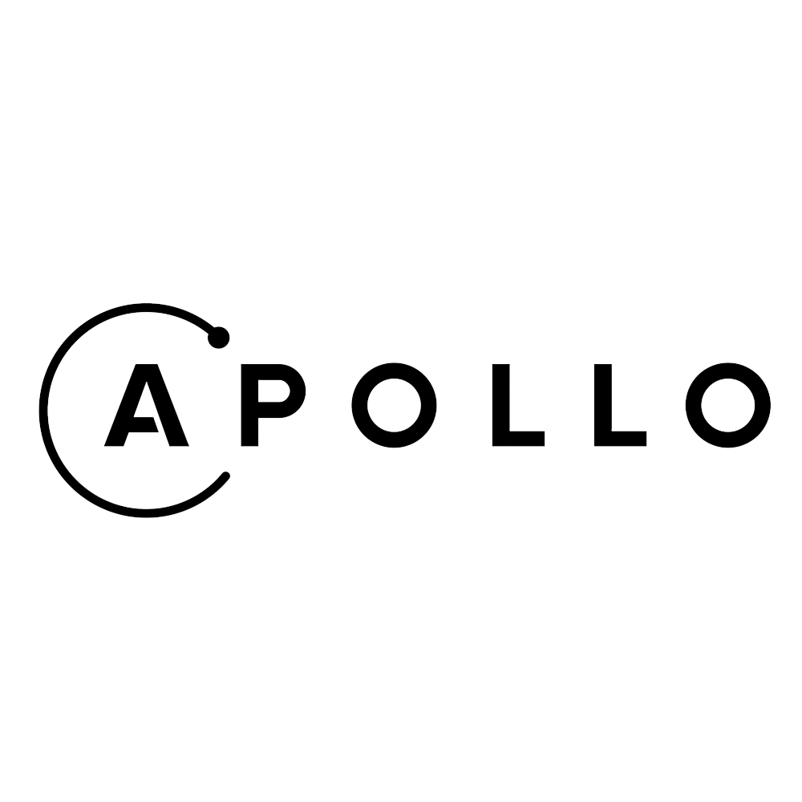
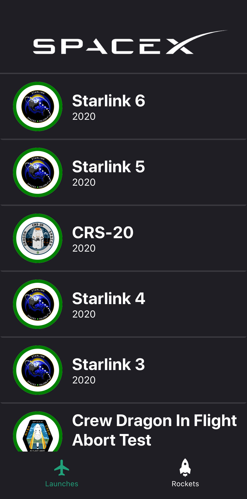
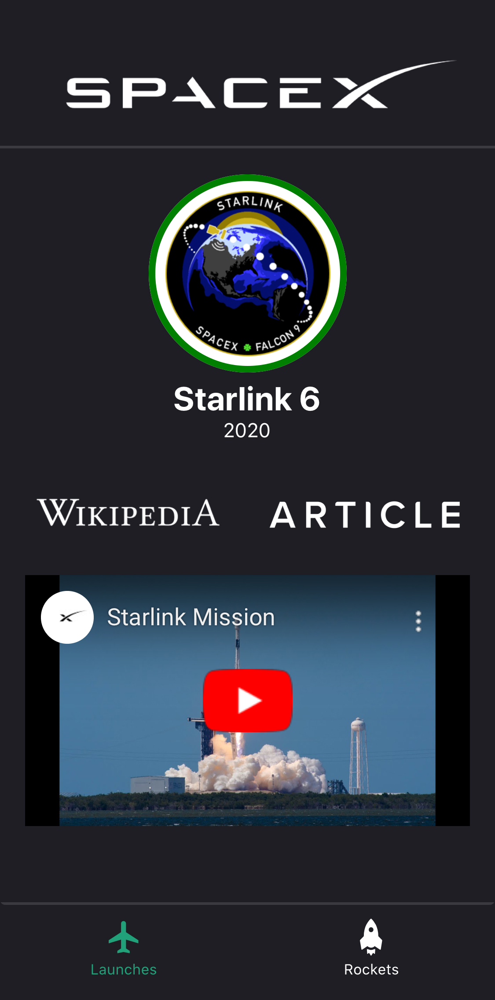
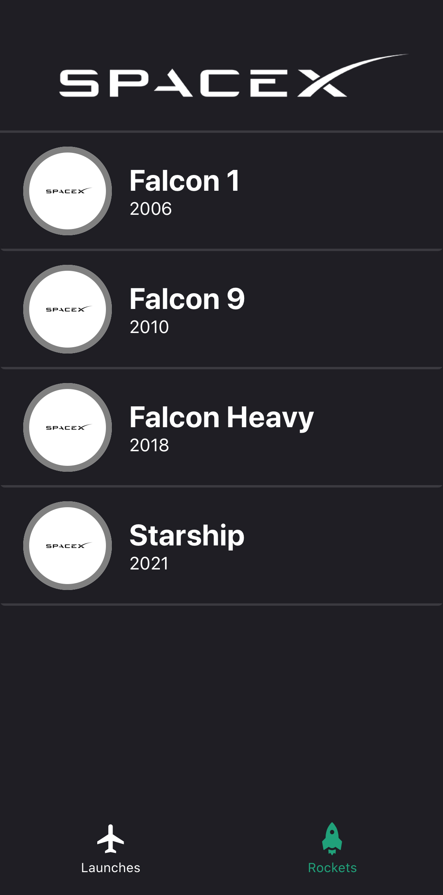
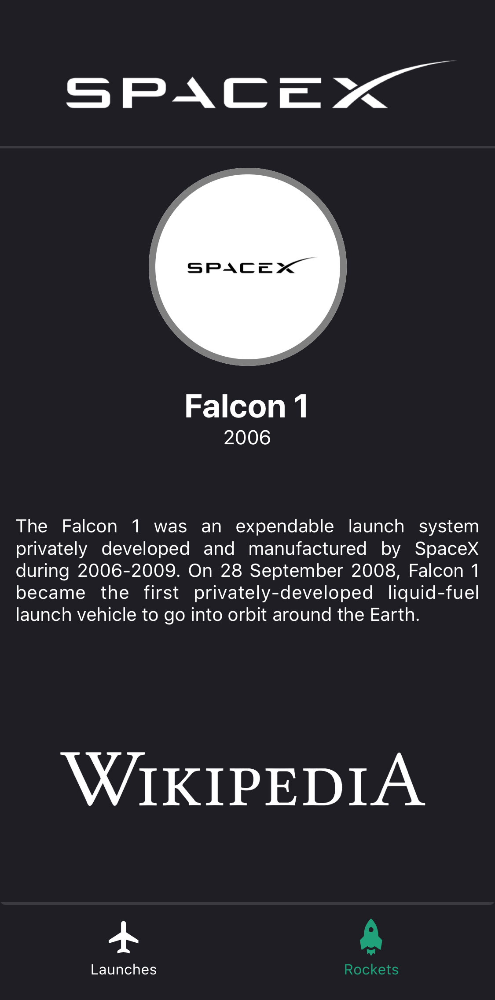

# spacex-native

A Native App that displays details about SpaceX Launches

## Documentation

The documentation for spacex-native can be viewed [here](https://iamkhattar.github.io/spacex-native/).

## Technology Stack

### Client

   

### Server

   

### Development

  

## Application

|  |  |  |  |  |
| ------------------------------------------ | :-----------------------------------: | ------------------------------------------- | :----------------------------------: | ------------------------------------------- |

## License

MIT
